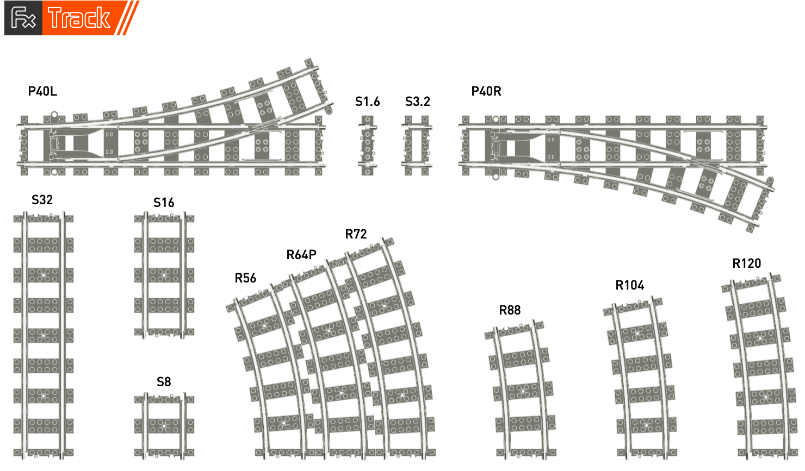
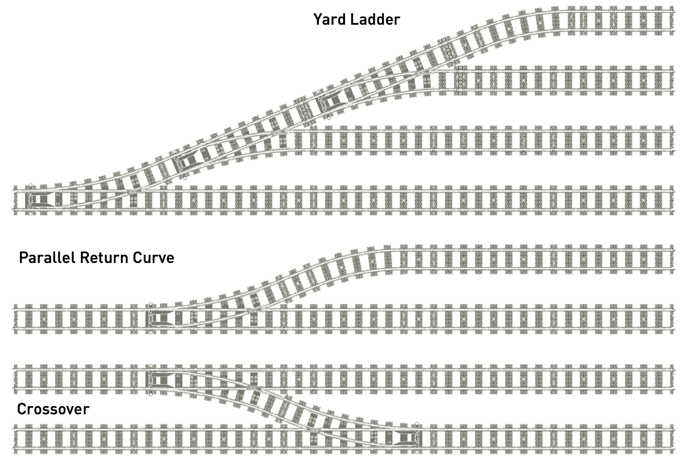

# fx-track-ldraw



This repository contains LDraw 3D models of the Fx Track system elements. These model files can be used with any LDraw compatible CAD application or generate high quality renders for instructions and illustrations.

## Installation

The contents of the `ldraw` folder can be copied into your LDraw installation folder's `Unofficial/parts` folder.

For example, for Bricksmith users on macOS, add the Fx Bricks LDraw parts as follows:

```shell
    $ git clone https://github.com/fx-bricks/fx-track-ldraw.git
    $ cd pfx-ldraw-models
    $ cp -R ldraw/* /Applications/Bricksmith/ldraw/Unofficial/parts
```

Make sure to reload/re-index the parts library in any tool that uses your LDraw installation.

## Usage

 These LDraw models can be used in a variety of LDraw compatible CAD software for producing composite models, instructions, documentation, etc.  The  models have been generated from raw CAD data with simplifications made to reduce the complexity of the resulting meshed objects.  Therefore, the dimensional data implied in these models does not necessarily reflect the actual physical configuration of the real Fx Track product.

## Examples




## References

- [LDraw.org](https://www.ldraw.org) - Official maintainer of the LDraw file format specification and the LDraw official part library.
- [L-Gauge.org](http://l-gauge.org) - L-Gauge model train system reference site

### Lego CAD Tools

- [Bricklink stud.io](https://www.bricklink.com/v3/studio/download.page) new and modern design tool designed and maintained by Bricklink
- [LeoCAD](https://www.leocad.org) cross platform tool
- [MLCAD](http://mlcad.lm-software.com) for Windows
- [Bricksmith](http://bricksmith.sourceforge.net) for macOS by Allen Smith (no longer maintained)
- [LDView](http://ldview.sourceforge.net) real-time 3D viewer for LDraw models

### LPub Instructions Tools

- Original [LPub](http://lpub.binarybricks.nl) publishing tool by Kevin Clague
- [LPub3D](https://trevorsandy.github.io/lpub3d/) successor to LPub by Trevor Sandy
- [Manual](https://sites.google.com/site/workingwithlpub/lpub-4) for Legacy LPub 4 tool (last version by Kevin Clague)
  

<a rel="license" href="http://creativecommons.org/licenses/by-nc-sa/4.0/"></a><br />This work is licensed under a <a rel="license" href="http://creativecommons.org/licenses/by-nc-sa/4.0/">Creative Commons Attribution-NonCommercial-ShareAlike 4.0 International License</a>.

